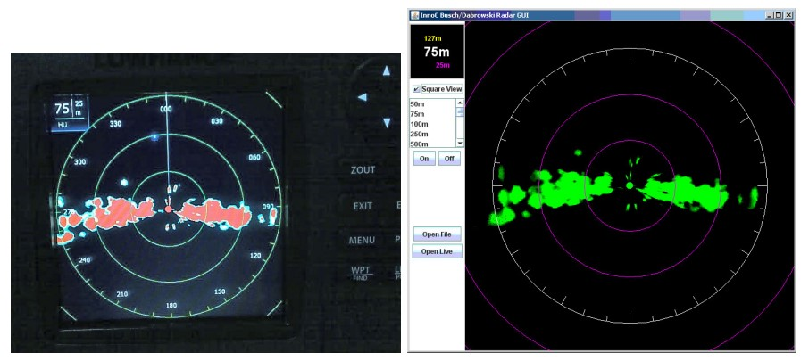

# OpenBR24

OpenBR24 is a sample implementation of the Lowrance Navico BR24 network protocol as described in the paper titled **"A Digital Interface for Imagery and Control of a Navico/Lowrance Broadband Radar"** by Adrian Dabrowski, Sebastian Busch, and Roland Stelzer.

The final publication is available in print (Robotic Sailing, 2011, ISBN 978-3-642-22835-3) and online at <a href="https://www.researchgate.net/publication/226363952_A_Digital_Interface_for_Imagery_and_Control_of_a_NavicoLowrance_Broadband_Radar/" target="_blank">ResearchGate</a>.


A photograph of the display unit and a screenshot of the JAVA program showing the same data.

## Usage

To use OpenBR24, follow these steps:

1. Connect to boat's network
2. Start the GUI class or run the .jar file provided.
2. Choose to open a live radar ("Open Live") device or a recording ("Open File"). Recordings are read from PCAP-files. You can create your own recordings using tools like Wireshark or tcpdump.
3. If you open a live device, turn it on using the "Power On" button. You can then select the range of the radar from the listbox. In playback mode, the range is defined by the recorded data.

## Installation

### Prerequisites

OpenBR24 requires the jnetpcap library, which in turn requires libpcap. Ensure you have these dependencies installed and Java SE Development Kit 17.0.10.

### Resolve Erros

If you encounter java.lang.UnsatisfiedLinkError exceptions, follow these steps:

1. **Adjust libpcap version**: If using Ubuntu (and possibly other distributions) with libpcap.so.1.1.1, create a symbolic link as root:
```bash
ln -s /usr/lib/libpcap.so.1.1.1 /usr/lib/libpcap.so.0.9
```

2. **Handle native Java bindings**: Depending on your platform, Java might fail to distinguish between 32-bit and 64-bit systems. Copy or symlink the appropriate .dll/.so file in the `$PROJECT/lib/jnetpcap/` directory.

3. **Add multicast network route**: Ubuntu (and possibly other distributions) may require adding a route to the multicast network on the network adapter connected to the radar antenna unit. For example:

```bash
sudo route add -net 224.0.0.0/4 dev eth0
```

## Development

This project has been successfully run in a Windows environment using JDK 17. If you wish to contribute or make alterations, you can follow these steps:

1. Download and install Visual Studio Code (VS Code).
2. Clone this repository to your local machine using Git:
```bash
git clone https://github.com/your_username/OpenBR24.git
```
3. Open the cloned repository in VS Code to start making changes or contributions.

## Credits

- Original Authors: Adrian Dabrowski, Sebastian Busch
- Updated by: Alexandros Paliampelos

## Changes Made

This updated version of OpenBR24 incorporates various improvements and fixes to ensure compatibility with the latest Java version and resolve several issues encountered during the update process. The primary changes made include:

- Upgraded the codebase to work with the latest Java version.
- Resolved compatibility issues with socket and binding configurations.
- Minor improvements to enhance overall performance and stability.

## Legal

OpenBR24 is free software released under the GNU General Public License as published by the Free Software Foundation. Refer to the [LICENSE](LICENSE) file for details.

This software utilizes the jnetpcap-Library and IpReassemblyExample, both licensed under LGPL.